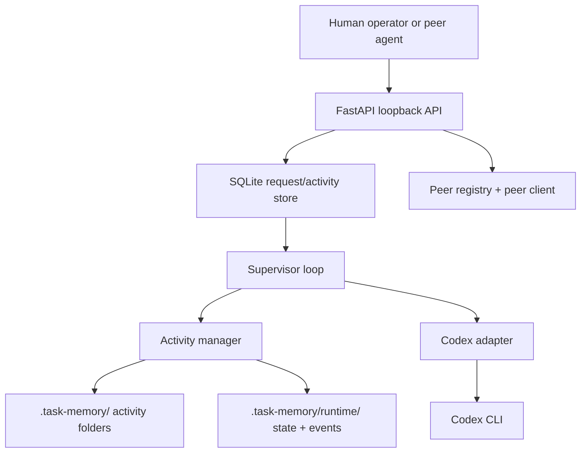
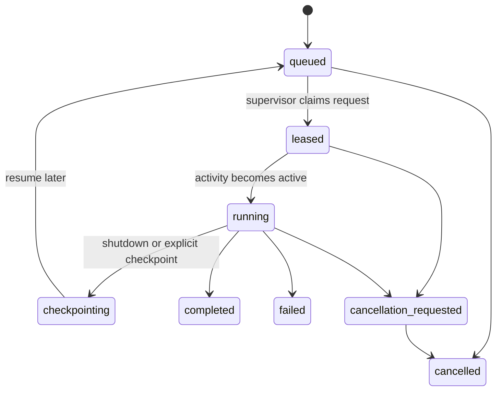

# Architecture

## 1. Top-level design

Agent Ludens is a local supervisor system around Codex.

## 2. Major components

### 2.1 API listener

Responsibilities:

- expose loopback-only HTTP endpoints
- validate payloads and auth headers
- persist requests before returning `202 Accepted`
- expose read-only status, activity, peer, and event inspection endpoints

### 2.2 SQLite store

Responsibilities:

- durable request state machine
- durable activity metadata
- idempotent request insertion
- request event history
- peer registry
- lease ownership + expiry metadata

### 2.3 Activity manager

Responsibilities:

- create activity folders and scaffold files
- write `state.json`, `summary.md`, `checkpoint.json`, and `inbox.md`
- persist Codex artifacts under `.task-memory/codex/`
- maintain runtime state files and event log
- maintain `session_map.json`

### 2.4 Supervisor loop

Responsibilities:

- own the single active execution slot
- choose the next runnable request or free-time quantum
- manage checkpointing, cancellation, and recovery
- respect lease reclaim and exclusivity rules

### 2.5 Codex adapter

Responsibilities:

- run `codex exec --json <prompt>` for fresh turns
- run `codex exec resume <session_id> --json <prompt>` for resumed turns
- parse JSONL events
- capture session id, final message, stderr, exit code, and approval-blocked failures

### 2.6 Peer client

Responsibilities:

- submit requests to peer runtimes over loopback HTTP
- carry auth token when configured
- support the submit + poll contract

### 2.7 Observability surface

Responsibilities:

- keep runtime state visible in `.task-memory/runtime/`
- keep activity summaries/checkpoints visible in activity folders
- surface recent runtime events through a minimal read-only API

## 3. Process model

Production-ready v0 targets one Python process tree per runtime root:

- FastAPI listener
- one supervisor background task
- zero or one active Codex subprocess at a time

The preferred shape remains one Python process with explicit startup/shutdown hooks.

## 4. Supervisor exclusivity

A concrete local supervisor lock is required. The lock must:

- live under `.task-memory/runtime/supervisor.lock`
- prevent two runtimes from owning the same persistence root at once
- be acquired before scheduling work
- be released on clean shutdown
- be tested with a double-start / contention scenario

## 5. Request lifecycle

Lease metadata must reflect a real TTL. Reclaiming an expired lease is part of normal
recovery and scheduling behavior.

## 6. Activity model

Every unit of work is an activity. Shared rules:

- only one activity may actively drive Codex at a time
- every activity has a durable folder
- request-driven and free-time activities share the same persistence contract
- existing `activity_id` values are reused when a request resumes after requeue

## 7. Scheduling model

Priority order:

1. recoverable queued work that already has an activity/checkpoint
2. newly queued human or peer requests by priority
3. free-time work when the queue is empty

Free-time work must run in one-turn quanta and yield back to the scheduler after each turn.

## 8. Recovery model

On startup the supervisor must:

1. acquire the supervisor lock
2. inspect request rows for leased/running/checkpointing state
3. reclaim expired leases and normalize interrupted work
4. inspect activity folders for incomplete state
5. rebuild runtime state and continue scheduling

Recovery should prefer reusing an existing `activity_id` and `session_id` when the
persisted checkpoint still matches the request.

## 9. Observability model

Canonical observability artifacts are:

- `.task-memory/runtime/agent_state.json`
- `.task-memory/runtime/scheduler_state.json`
- `.task-memory/runtime/event-log.jsonl`
- activity `summary.md` and `checkpoint.json`
- `.task-memory/codex/<activity_id>/latest.jsonl`
- `.task-memory/codex/<activity_id>/last_message.txt`
- `.task-memory/codex/<activity_id>/stderr.log`

A minimal read-only API should expose recent events without requiring private SQLite access.

## 10. Security posture

Production-ready v0 stays intentionally narrow:

- bind only to `127.0.0.1`
- optional shared-secret auth via `X-Agent-Token`
- reject unknown payload shapes
- do not expose the runtime publicly

## 11. Deferred architecture work

The following are explicitly outside the v0 architecture:

- frontend/server split for an owner UI
- registry/marketplace services
- multi-machine discovery or networking
- token settlement systems
