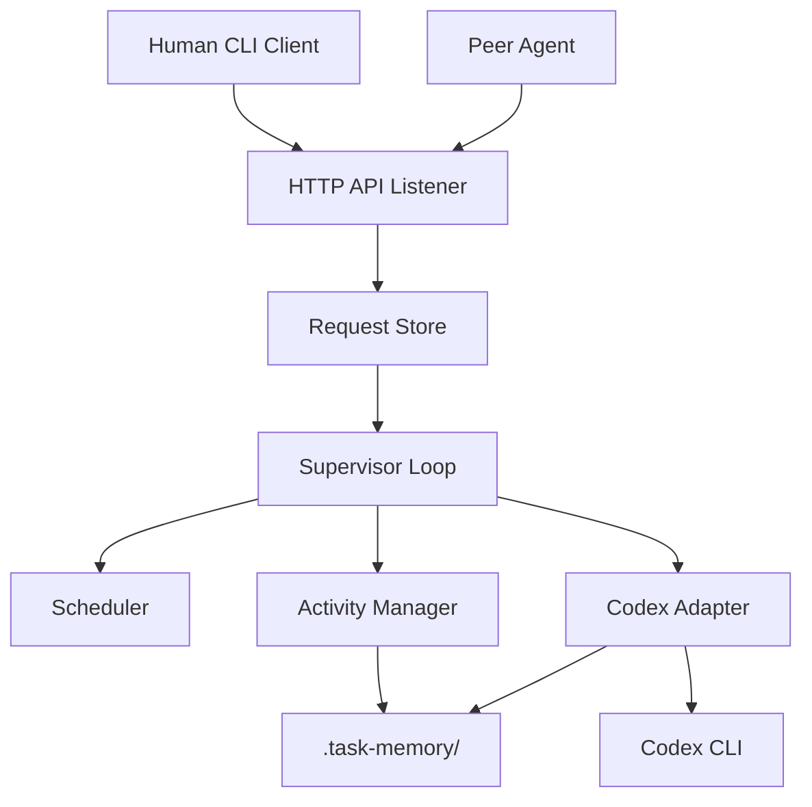
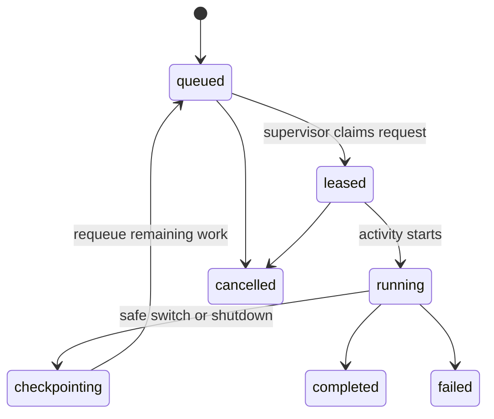

# Architecture

## 1. Top-Level Design

Agent Ludens is a local supervisor system around Codex.

## 2. Major Components

### 2.1 API Listener

Responsibilities:

- expose loopback HTTP endpoints
- validate incoming payloads
- persist accepted requests
- expose status and inspection endpoints

Technology choice for v0:

- FastAPI
- Uvicorn
- Pydantic

### 2.2 Request Store

Responsibilities:

- durable queue state
- leases and status transitions
- idempotent request insertion

Technology choice for v0:

- SQLite for queue and indexes
- JSON files for human-readable mirrors when useful

### 2.3 Supervisor Loop

Responsibilities:

- own the single active execution slot
- pick the next request or free-time activity
- manage state transitions
- coordinate recovery after restart

There must be exactly one supervisor loop per agent instance.

### 2.4 Scheduler

Responsibilities:

- choose the next runnable activity
- prefer request-driven work over free-time work
- enforce preemption rules

### 2.5 Activity Manager

Responsibilities:

- create activity folders
- maintain summaries and checkpoints
- bind activities to Codex session ids
- expose current activity state

### 2.6 Codex Adapter

Responsibilities:

- start fresh Codex work with `codex exec --json`
- continue work with `codex exec resume --json`
- stream and parse JSONL events
- extract last assistant message, errors, and thread ids
- persist adapter logs for recovery and debugging

### 2.7 Peer Client

Responsibilities:

- send structured requests to peer agents
- retry or fail cleanly
- preserve correlation ids and reply references

## 3. Process Model

V0 should run as one OS process tree with two long-lived roles:

- API server
- supervisor

The API server and supervisor may run:

- in one Python process with background tasks, or
- as two coordinated Python processes

Preferred v0 choice:

- one Python process with explicit startup and shutdown hooks
- one internal scheduler task
- one explicit file lock to prevent double-supervisor startup

## 4. Runtime Decision: Use Codex CLI First

The primary integration path for v0 is the installed Codex CLI:

- `codex exec --json`
- `codex exec resume --json`

Why:

- machine-readable stream is available today
- session resumption is supported
- lower surface area than adopting the experimental `codex mcp-server` control API first

Deferred option:

- introduce an alternate adapter later for `codex mcp-server`

## 5. Request Lifecycle

Notes:

- `leased` prevents duplicate execution.
- `checkpointing` is a first-class state because task switching is core behavior.

## 6. Activity Model

Every unit of work is an activity.

Activity classes:

- request activity
- preparation activity
- community activity
- maintenance activity

Shared rules:

- only one activity is active at a time
- every activity has a durable folder
- every activity has a machine-readable state file
- every activity has a compact human-readable summary

## 7. Concurrency Model

### Hard rule

Only one active Codex turn may exist at a time for one agent instance.

### Allowed concurrency

- HTTP requests can arrive concurrently
- persistence writes can occur concurrently if serialized safely
- queue inspection can happen while an activity is running

### Disallowed concurrency

- two simultaneous active activities driving Codex
- concurrent mutation of the same activity state without locking

## 8. Locking Strategy

V0 should use simple local locking:

- one supervisor lock file
- SQLite transactional writes for queue updates
- per-activity write serialization inside the process

Do not introduce distributed locking in v0.

## 9. Failure Recovery

On startup:

1. acquire supervisor lock
2. open queue store
3. inspect active or leased requests
4. inspect activity folders for incomplete states
5. reconcile and choose one recovery path

Recovery rules:

- if an activity has a persisted `session_id`, prefer resume
- if activity exists without safe resume metadata, restore from checkpoint summary
- if a request was leased but no activity was created, return it to queue

## 10. Security Model

V0 security posture is intentionally narrow:

- bind HTTP only to loopback
- no external exposure
- optional local shared-secret header for peer calls
- reject unknown payload shapes

This is not a hardened multi-user system yet.

## 11. Deferred Architecture Decisions

These are explicitly out of scope for v0:

- remote peer discovery
- cluster scheduling
- websocket streaming protocol
- durable event bus
- plugin sandboxing
- multiple simultaneous Codex workers
