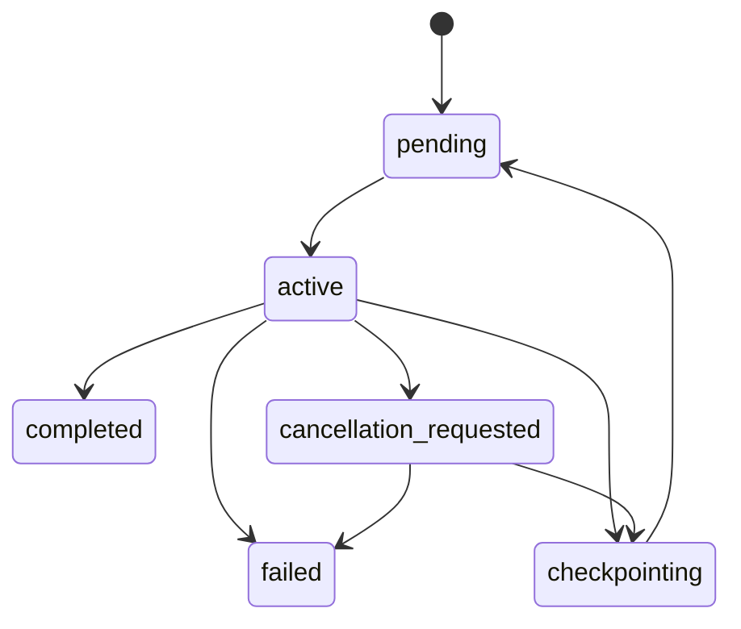

# Runtime Loop

## 1. Runtime Contract

The runtime owns one active working slot.

At any given time the agent is in one of these high-level states:

- `boot`
- `idle`
- `handling_request`
- `checkpointing`
- `free_time`
- `error_backoff`

## 2. Supervisor Loop

Pseudocode:

```python
while True:
    recover_if_needed()
    request = scheduler.pick_highest_priority_request()
    if request:
        run_request_activity(request)
        continue

    activity = scheduler.pick_free_time_activity()
    if activity:
        run_free_time_activity(activity)
        continue

    sleep(poll_interval)
```

This loop must be restart-safe and must never assume that in-memory state is still valid after a
crash.

## 3. Scheduling Rules

### 3.1 Priority order

1. urgent queued requests
2. normal queued requests
3. resumed in-progress request activities
4. free-time activities

### 3.2 Free-time eligibility

A free-time activity may run only when:

- no queued request exists above the free-time threshold
- no cancellation request is pending
- the supervisor is healthy

### 3.3 Fairness

Free-time work must use small execution quanta.

Recommended v0 rule:

- one Codex turn per free-time quantum
- after each quantum, re-check the request queue before continuing

## 4. Preemption Rules

Preemption applies mainly to free-time work.

If a real request arrives during free-time work:

1. mark the free-time activity as `checkpointing`
2. persist `summary.md` and `checkpoint.json`
3. release the working slot
4. start the higher-priority request

Request-driven work is not forcibly preempted in v0 except for cancellation or controlled
shutdown.

## 5. Activity State Machine



## 6. Codex Adapter Contract

### 6.1 Start new work

Use:

```text
codex exec --json <prompt>
```

The adapter must parse JSONL events and capture:

- `thread.started.thread_id`
- item events
- `turn.completed`
- `turn.failed`
- final assistant message

### 6.2 Resume existing work

Use:

```text
codex exec resume <session_id> --json <prompt>
```

Resume is preferred when:

- the activity already has a `session_id`
- the prior session is still relevant to the current activity

### 6.3 Output persistence

For each turn, persist:

- raw JSONL stream
- extracted final assistant message
- adapter metadata such as exit code and timestamps

## 7. Prompt Header Construction

Each turn prompt should have two parts:

1. fixed header from persisted state
2. turn-specific instruction

Recommended fixed header template:

```text
Agent identity: <agent_id>
Role: <role>
Active activity: <activity_id>
Namespace: <namespace>
Current objective: <one paragraph>
Queue snapshot: <compact summary>
Completed so far:
- ...
Pending next steps:
- ...
Important constraints:
- ...
Durable state files:
- state.json: ...
- summary.md: ...
- checkpoint.json: ...
```

Rules:

- keep it compact
- prefer summaries over raw history
- include only files relevant to the current activity

## 8. Checkpoint Policy

Checkpoint at least:

- before switching activities
- before shutdown
- after each meaningful Codex turn
- after any partial failure that still leaves recoverable work

Checkpoint contents must be enough for a new session to continue without rereading the whole past.

## 9. Error Handling

### 9.1 Codex subprocess failure

If Codex exits non-zero:

- persist adapter logs
- mark activity `failed` or `pending` depending on recoverability
- write an event log entry
- back off before retry if retryable

### 9.2 Approval-blocked behavior

V0 must assume non-interactive runs can fail if they need new approval.

Therefore:

- use a trusted non-interactive profile in live deployments, or
- constrain generated actions to avoid approval-triggering situations

Approval-blocked failures must be surfaced clearly in activity state.

## 10. Shutdown Behavior

On graceful shutdown:

1. stop accepting new work or mark the server draining
2. checkpoint active activity
3. flush queue and event logs
4. release supervisor lock

On ungraceful shutdown:

- recovery must infer incomplete work from persisted state on next boot

## 11. Runtime Acceptance Criteria

The runtime loop is correct if:

1. only one activity owns the working slot at a time
2. free-time work is preemptible at quantum boundaries
3. restart recovery can continue a persisted activity
4. the prompt header can be regenerated from files alone
